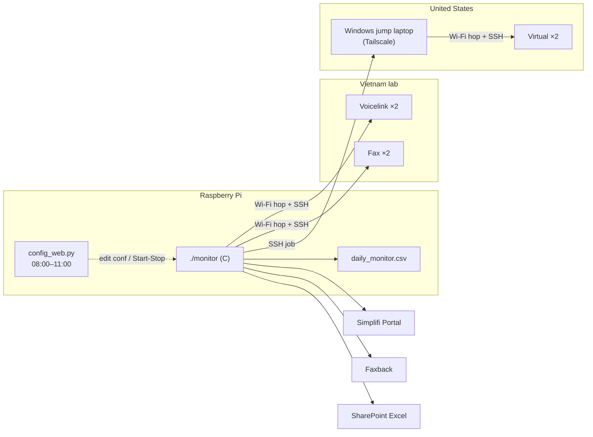
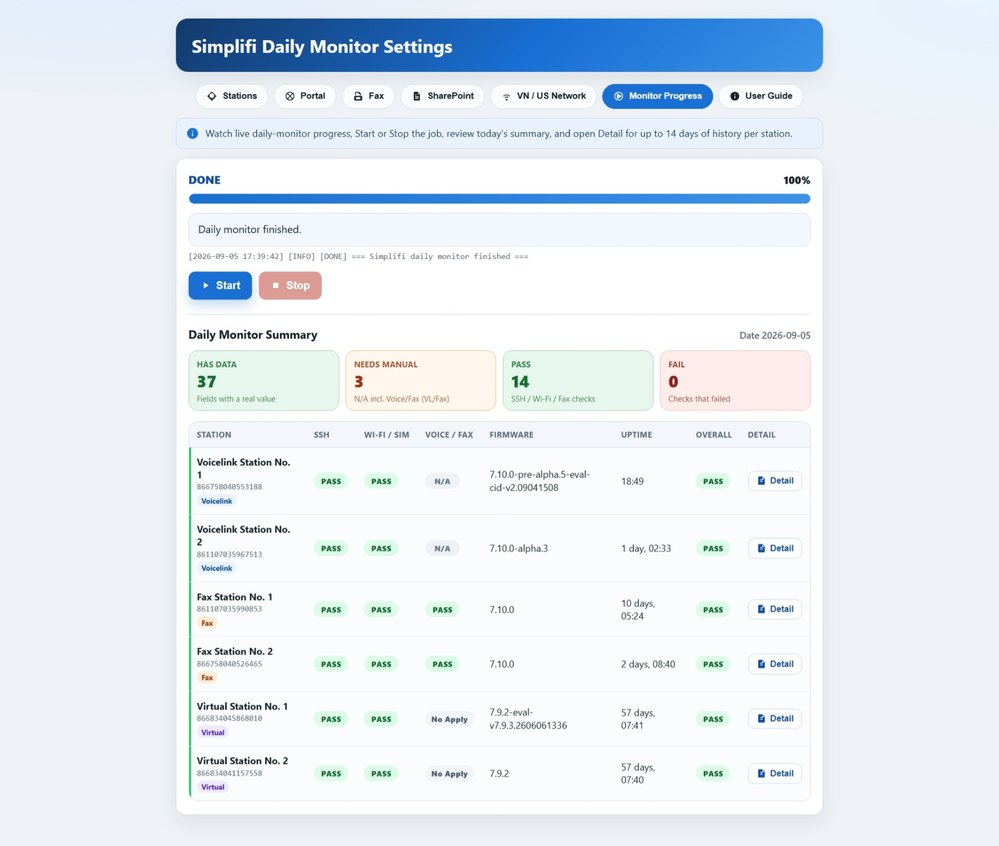
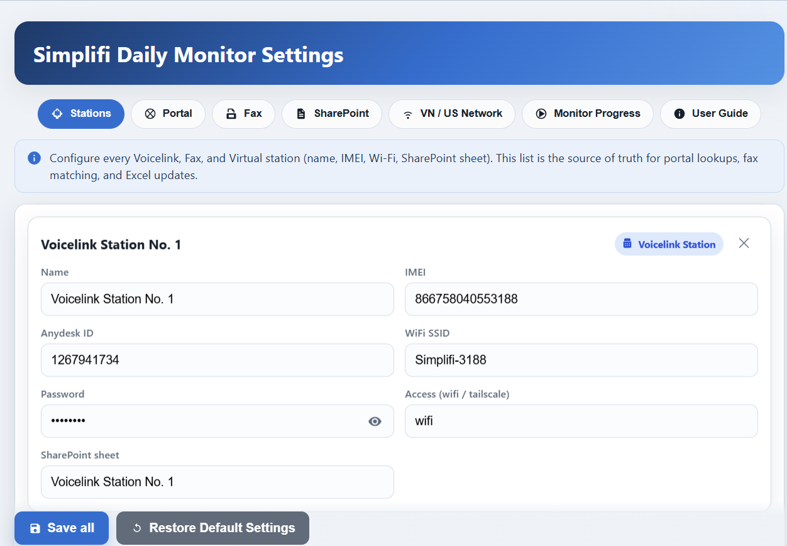

# Automate Daily Monitor

**Raspberry Pi–based daily health automation for multi-site cellular router stations** (C11 + Python).

A solo project by a **QA Firmware** engineer at **Simplifi Company Limited** — automates what used to be a manual morning checklist across **Vietnam lab stations** (Voicelink + Fax) and **US Virtual stations**, then writes results to CSV and SharePoint Excel.

> **Security note:** Never commit real passwords, TOTP secrets, or API keys. Use `*.conf.example` templates and keep live `*.conf` / `token_cache.bin` gitignored.

---

## Why this exists

Lab operators previously had to:

1. Hop Wi‑Fi to each station router and SSH in for firmware / uptime / SIM / RSSI
2. Check Fax delivery and portal logs by hand
3. Reach US Virtual stations via a separate laptop
4. Copy results into a shared Excel workbook

This project runs that pipeline **unattended every morning** on a Raspberry Pi, with a short-lived **local config web UI** for settings and live progress.

---

## Architecture (one glance)




Full stage list → [docs/ARCHITECTURE.md](docs/ARCHITECTURE.md)

---

## Config web UI

Local settings + Monitor Progress UI on the Pi (`http://<pi-ip>:8765`, mornings 08:00–11:00).

<!-- Drop real screenshots into docs/assets/ (same filenames). Crop/blur any secrets. -->





---

## Highlights (embedded / systems facing)


| Area                            | What was built                                                                                         |
| ------------------------------- | ------------------------------------------------------------------------------------------------------ |
| **Systems C on Linux**          | `nmcli` Wi‑Fi join/restore, SSH over PTY, gateway probing, structured logging + `%` progress JSON      |
| **Multi-network orchestration** | Leave lab SSID → station AP → collect → return to lab; US path via Tailscale jump host                 |
| **Router telemetry**            | Parse OpenWrt-style `ubus` / modem (`simcom`) output into CSV fields                                   |
| **Python side-car stages**      | Portal (Selenium + TOTP), Faxback, SharePoint Graph Excel fill                                         |
| **Ops**                         | `systemd` timer at **08:00**; config UI auto-starts **08:00** and stops after **3h**                   |
| **Operator UX**                 | Local web UI: stations/conf edit, live Monitor Progress, Daily Summary, per-station history (≤14 days) |


---

## Tech stack (short)


| Layer              | Tools                                                            |
| ------------------ | ---------------------------------------------------------------- |
| Language           | **C11** (`gcc`), **Python 3** (venv)                             |
| Host               | **Raspberry Pi 4 Model B Rev 1.5** · Debian 13 (trixie) · 64-bit |
| Networking         | NetworkManager (`nmcli`), OpenSSH, Tailscale                     |
| Automation UI      | Custom HTTP UI (`scripts/config_web.py`, port **8765**)          |
| Browser automation | Chromium + Selenium + `pyotp`                                    |
| Cloud              | Microsoft Graph / MSAL (SharePoint Excel)                        |


Details → [docs/TOOLS.md](docs/TOOLS.md) · Hardware → [docs/HARDWARE.md](docs/HARDWARE.md)

---

## Repository layout

```text
├── src/                 # C monitor binary (Wi‑Fi, SSH, pipeline)
├── include/             # Shared C headers
├── scripts/             # Python stages + config web UI
├── deploy/              # systemd units + install scripts
├── output/              # Runtime CSV / logs (local; typically gitignored)
├── docs/                # Extended documentation + UI screenshots (docs/assets/)
├── Makefile
└── *.conf.example       # Safe config templates
```

UI screenshots (add your PNGs here):

```text
docs/assets/ui-monitor-progress.png
docs/assets/ui-stations.png
```

---

## Quick start

Project path on the Raspberry Pi:

```bash
cd /home/pi/Workspace/Daily_Monitor/automate-daily_monitor

sudo apt-get install -y build-essential network-manager openssh-client \
  python3 python3-venv python3-pip chromium chromium-driver

make            # builds ./monitor
make deps       # creates .venv + pip install -r requirements.txt

cp monitor.conf.example monitor.conf
cp portal.conf.example portal.conf
cp fax.conf.example fax.conf
cp sharepoint.conf.example sharepoint.conf
chmod 600 monitor.conf portal.conf fax.conf sharepoint.conf
# Fill secrets / SSIDs / jump host — see docs/SETUP.md

./monitor -c monitor.conf
```

Enable daily schedule + morning config UI:

```bash
sudo bash deploy/install-timer.sh
sudo bash deploy/install-config-web-timer.sh
# Suggested: sudo timedatectl set-timezone Asia/Ho_Chi_Minh
```

Config UI (while running): `http://<pi-lan-ip>:8765`  
Find the Pi IP with: `hostname -I`

Full setup → [docs/SETUP.md](docs/SETUP.md)

---

## Documentation


| Doc                                          | Contents                                             |
| -------------------------------------------- | ---------------------------------------------------- |
| [docs/ARCHITECTURE.md](docs/ARCHITECTURE.md) | End-to-end daily flow, data artifacts, status labels |
| [docs/HARDWARE.md](docs/HARDWARE.md)         | Pi, routers, networks, jump laptop                   |
| [docs/SETUP.md](docs/SETUP.md)               | Build, config, systemd, troubleshooting              |
| [docs/TOOLS.md](docs/TOOLS.md)               | Languages, libraries, IDE, versions                  |


---

## Status & scope

- **Author / role:** Solo project by a QA Firmware engineer at Simplifi Company Limited (lab automation for daily station monitoring).
- **Not automated:** Desk-phone / Voicelink *call* quality remains **manual** (CSV often shows Voice status as N/A → “Needs manual” in the UI).
- **Publishing:** Keep live passwords, TOTP, and API keys private. Before making the repo public, decide with the company whether real IMEIs, SSIDs, Tailscale IPs, and internal portal/SharePoint URLs should stay, be redacted, or replaced with examples.

---

## License

[MIT](LICENSE) © Simplifi Company Limited