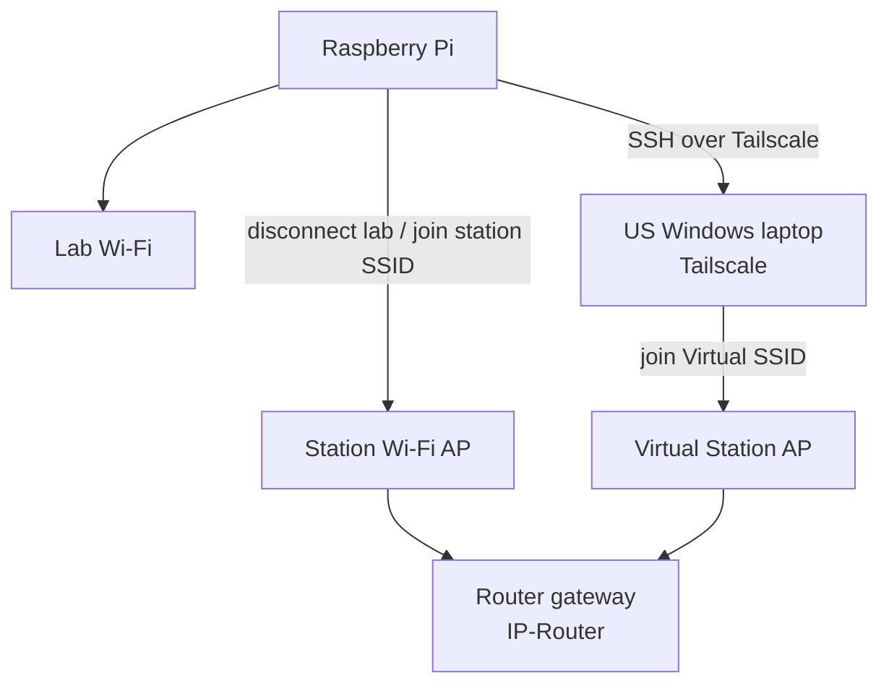

# Architecture — Daily Monitor Pipeline

This document describes **what runs each morning**, in order, and how data moves through the system.

> Related: [README](../README.md) · [Hardware](HARDWARE.md) · [Setup](SETUP.md)

---

## Goals

1. Collect **health fields** from up to **6 stations** (2 Voicelink, 2 Fax, 2 Virtual).
2. Enrich with **portal logs**, **Faxback** result, and **SharePoint** workbook update.
3. Expose **live progress** + **daily summary** via the local config web UI.

---

## High-level components

| Component | Role |
|-----------|------|
| `./monitor` (C) | Orchestrator: Wi‑Fi, VN SSH collect, invoke Python stages, status JSON |
| Python scripts under `scripts/` | US jump, portal, fax, SharePoint, config UI |
| `monitor.conf` (+ portal/fax/sharepoint) | Runtime configuration (gitignored when filled) |
| `output/daily_monitor.csv` | Canonical daily result table |
| `output/monitor_status.json` | Live UI progress (`flow`, `percent`, …) |
| systemd timers | Unattended 08:00 start |

---

## Daily pipeline (ordered stages)

Stages are driven from `src/monitor.c`. Feature flags in `monitor.conf` can skip Python stages (`portal_logs`, `fax_send`, `laptop_sync`, `sharepoint_excel`).

```text
SETUP
  → LAB WIFI          join lab SSID (5 GHz preferred, 2.4 GHz fallback)
  → VN SSH            for each Wi‑Fi station: hop AP → SSH → parse → CSV upsert → leave AP
  → LAB WIFI          restore lab SSID
  → US SSH            scripts/us_jump_run.py → Windows jump laptop → Virtual stations
  → PORTAL GET LOG    scripts/portal_logs.py
  → FAX PRINT         scripts/send_fax.py + apply fax_status.txt
  → LAPTOP SYNC       scp CSV (+ logs) to lab laptop
  → FILL SHEET        scripts/sharepoint_excel.py
  → DONE
```

Log lines use a consistent shape:

```text
[timestamp] [LEVEL] [FLOW] message
```

Examples of `FLOW` tags: `VN SSH`, `US SSH`, `PORTAL GET LOG`, `FAX PRINT`, `FILL SHEET`, …

The web UI paraphrases the current flow for operators (`scripts/monitor_progress.py`).

---

## Station reachability



| Type | How collected | Voice / Fax column |
|------|---------------|--------------------|
| **Voicelink** | Pi joins `Simplifi-####` → SSH `root@<IP-Router>` | Often **N/A** (call check is manual) |
| **Fax** | Same as Voicelink for radio/SSH; Fax PASS/FAIL from Faxback queue later | **Fax Status** from automation |
| **Virtual** | `access=tailscale` → **not** in Pi Wi‑Fi loop; collected on US jump laptop | **No Apply** in summary UI |

Gateway config keys: `router_gateway` / `router_gateway_alt` in `monitor.conf` (values are the station `<IP-Router>` addresses).

**Virtual path:** Daily collection uses the **US jump laptop only**. Direct Tailscale SSH from the Pi to Virtual routers is not part of the production pipeline.

---

## Data model (CSV)

Primary file: `output/daily_monitor.csv` (path overridable via `output_csv=`).

Typical columns:

| Column | Source (typical) |
|--------|------------------|
| Date | Collection day |
| Anydesk ID | Config / station card |
| IMEI | Config |
| Firmware Version | Router SSH / modem parse |
| Uptime (hh:mm) | Router `uptime` parse |
| Voicelink/Fax status | N/A (VL), Faxback (Fax), N/A (Virtual) |
| Carrier / Phone / RSSI (dBm) | Modem / ubus parse |
| WiFi Status (Sim Data) | Data connectivity check (e.g. ping) |
| SSH Access | SSH session success |
| Note | Reserved / unused in current pipeline |

**Upsert key:** `(Date, IMEI)` — re-runs update the same day’s row.

CSV retention: older rows are pruned periodically by the C monitor (keeps a rolling window of recent days).

---

## Vietnam SSH collect (per station)

Conceptual steps inside the VN loop:

1. `nmcli` connect to station SSID / PSK from `router.N.*`
2. Wait for L3 (gateway `<IP-Router>` reachable)
3. SSH as `ssh_user` (default `root`) with PTY helper (`src/ssh_pty.c`)
4. Run the CPE command set below; parse into a `MonitorRow` (`src/parse.c`)
5. Upsert CSV
6. Disconnect station Wi‑Fi and continue

### CPE commands (golden set)

Executed over SSH after login (`src/monitor.c`):

| Command | Fills |
|---------|--------|
| `ubus call cellular status` | IMEI, carrier/operator, phone/MSISDN, RSSI |
| `simcom get firmware_version` | Firmware Version |
| `uptime` | Uptime (days, hh:mm) |
| `ping -c 3 -W 3 google.com` | WiFi Status (Sim Data) PASS/FAIL from packet loss |

SSH Access is derived from whether the SSH session + collect path succeeds.

---

## US Virtual collect

1. Pi writes a job description and invokes `scripts/us_jump_run.py`
2. Script reaches `jump_host` (Tailscale IP) as `jump_user`
3. On the Windows laptop, `us_jump_collect.py` hops each Virtual station Wi‑Fi, SSHes the gateway, writes `results.json`
4. Pi merges results into `daily_monitor.csv`
5. Laptop restores prior Wi‑Fi when possible (`jump_restore_ssid` or auto-detect)

Artifacts commonly used: `output/us_jump_job.json`, `output/us_jump_results.json` (see `scripts/us_jump_run.py` for exact names).

---

## Enrichment stages

### Portal logs

- `scripts/portal_logs.py` — Selenium login (email/password + TOTP), download per-IMEI logs under `output/routers_log/DD_MM_YYYY/`.

### Fax

- `scripts/send_fax.py` — send test fax / poll Faxback queue; writes `output/fax_status.txt` (`IMEI=PASS|FAIL`).
- Monitor applies those lines into the Fax stations’ status column.

### Laptop sync

- `scp` CSV (and related logs) to `laptop_host` for local Excel users.

### SharePoint

- `scripts/sharepoint_excel.py` — Microsoft Graph **in-place cell updates** (avoids whole-file overwrite / lock issues when possible).
- Auth via MSAL + `token_cache.bin` (local; gitignored).

---

## Progress & operator UI

| Mechanism | Purpose |
|-----------|---------|
| `output/monitor_status.json` | `running`, `flow`, `percent`, `message`, `updated` |
| `GET /api/progress` | Snapshot for Monitor Progress tab |
| `POST /api/monitor/start\|stop` | Launch/stop `./monitor` from UI |
| `GET /api/station/history?imei=&days=14` | Detail history (≤14 days) |
| Daily Summary | Counts filled vs N/A (Needs manual), PASS/FAIL, color table |

Summary rules (UI):

- **Needs manual** = info fields still N/A **plus** Voice/Fax N/A on Voicelink/Fax (Virtual Voice/Fax = **No Apply**, not counted).
- **Overall** ≈ SSH, forced FAIL if Wi‑Fi/SIM check FAIL.

---

## Scheduling (ops view)

| Unit | When | Action |
|------|------|--------|
| `simplifi-monitor.timer` | 08:00 daily | `oneshot` run of `./monitor` |
| `simplifi-config-web.timer` | 08:00 daily | start UI; `RuntimeMaxSec=3h` → stop ~11:00 |

See [SETUP.md](SETUP.md) for install/stop commands.

---

## Failure & recovery notes

- VN SSH failure on one station should **not** block later stations or the US jump stage (US is gated on `jump_host` being configured).
- Lab Wi‑Fi restore runs after the VN loop so the Pi can reach internet / Tailscale / portal again.
- SharePoint uses Microsoft Graph **in-place cell updates** when possible (avoids whole-file upload lock / HTTP `423` while Excel is open).

---

## Security boundaries

- Secrets live only in gitignored conf files on the Pi.
- Config web binds `0.0.0.0:8765` during the morning window — treat as **lab-LAN / Tailscale only** (do not port-forward to the public Internet). Hardening later (bind to Tailscale IP only, or add auth) is optional.
